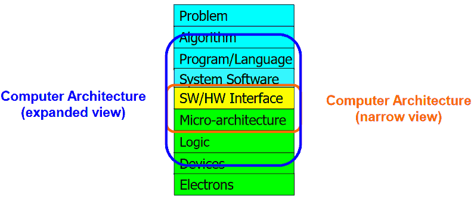
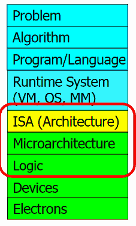

# Lecture 01 - Introduction and Basics

## Info

* [Video Link](http://www.youtube.com/watch?v=PMJxcArLU1E)
* [Lecture Slides](https://safari.ethz.ch/digitaltechnik/spring2018/lib/exe/fetch.php?media=digitaldesign-s18-lecture1-intro.pdf)

## Reading

* [@jouppi2017datacenter]
* Chapter 1 in [@harris2012digital]
* Chapter 1-2 in [@patt2005introduction]
* [Binary Numbers](https://safari.ethz.ch/digitaltechnik/spring2018/lib/exe/fetch.php?media=reading-week1_binarynumbers.pdf) (*Done*)
* [@hamming1986you] (*Done*)
* [@hamming2012numerical]
* [@hamming1950error]

## Lecture Minutes

* **29:00** Importance of principled design
* **40:00** *architecture based upon principle not upon precedent* Precedent means examples from past. Design should have some principles and shouldn’t build blindly on past or wide spread approaches. For example, let’s consider Spectre and Meltdown. In those cases, precedent is building a fast processor. But designer might have considered security principle to avoid this kind of flaws.
* **44:00** Although technology changes over time, fundamental techniques and principles may remain similar.
* **48:00** Mini talk about [systolic array](../../../d/s/systolic-array.md) although it is kind of out of context.
* **01:03:00** Electrons → Transistors → Logic Gates → Combinational Logic Circuits → Sequential Logic Circuits (Storage Elements and Memory) → … → Cores → Caches → Interconnect → Memories → …
* **01:13:00** The transformation hierarchy is shown below. How can we talk with electrons? This is a fundamental question.

*Taken directly from the lecture notes. © belongs to Prof. Mutlu*

* **01:15:00** [algorithm](../../../d/a/algorithm.md) is defined.

*Taken directly from the lecture notes. © belongs to Prof. Mutlu*

See [ISA](../../../d/i/isa.md) and [microarchitecture](../../../d/m/microarchitecture.md) definitions.

* **01:24:00** VAX architecture, 3D array checking at hardware (?)

!!! todo
    What are they? 3D array checking?

\bibliography
