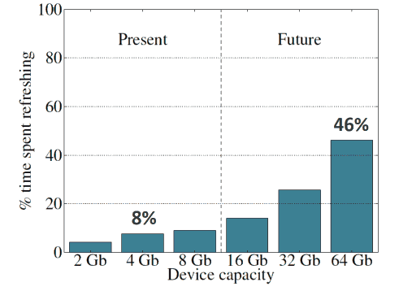
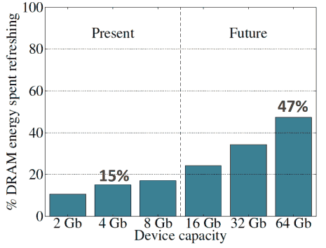

# Lecture 04 - Mysteries in Comp Arch and Basics

## Info

* [Video Link](http://www.youtube.com/watch?v=WZeYoDkzAmc)
* [Lecture Slides](https://safari.ethz.ch/digitaltechnik/spring2018/lib/exe/fetch.php?media=onur-digitaldesign-2018-lecture4-mysteries-basics-afterlecture.pdf)

## Reading

* Chapter 2 in [@harris2012digital]
* Chapter 3 in [@patt2005introduction]
* [@mutlu2007memory]
* [@rixner2000memory]
* [@mutlu2007stall]
* [@mutlu2008parallelism]
* [@muralidhara2011reducing]
* [@liu2012raidr]
* [@mutlu2013memory]
* [@chang2014improving]
* [@bloom1970space]
* [@zuravleff1997controller] (Couldn't notice during lecture, I added as reference since it is stated on course page)

## Lecture Minutes

* **04:30** Another mystery is **Memory Performance Attacks**.
* **10:00** [throughput computing](../../../d/t/throughput-computing.md) is mentioned.
* **10:55** We want N time the system performance with N times the cores. ([super linear scaling](../../../d/s/super-linear-scaling.md))
* **12:00** @[mutlu2007memory] is mentioned. They run MATLAB and GCC on different cores and measured slow down comparing standalone runs. MATLAB slows down 7% if GCC is running. But GCC slows down 204% if MATLAB runs on the other core. MATLAB somewhat slows down GCC. Even if in OS MATLAB is set to low priority and GCC is set to high priority, results don't change. The problem is not related with OS priorities. MATLAB “hogs” memory. In a fair system, this isn't expected. This is neither fair nor controllable system.
* **17:00** If you don't "cross layers", you can't understand the issue.
* **18:30** This is important because multi-core computing is everywhere: cloud, mobile, etc. Also there are different applications with different QoS requirements: video processing, pedestrian detection, etc.
* **20:00** Although each core has different cache, DRAM memory controller is shared between cores. It looks like memory controller prioritize request of MATLAB.
* **21:30** Deeper DRAM structure. A DRAM bank consists of 2D array of cells. Dimensions: Columns and Rows. There are also other components. To access row, you need to bring it to the row buffer. When you need to bring a row to the row buffer, you activate that row by applying high voltage. After data is in the buffer, you select a column depending on your address input.
* **25:30** If you access Row:0, Column:0 and then access Row:0 Column:1, you don't need the activate Row:0 again because Column:1 is also brought to the buffer when Row:0 is transferred to the buffer for Column:0. This is true for all Columns with the same Row number. If you access Row:1 after some access to Row:0. This takes some time. Because memory first writes back (pre-charge) content of buffer to Row:0, then opens Row:1.
* **29:40** Memory controller may prioritize memory access with the same row number (row-hit first), then serve older request (oldest-first). This is a commonly used scheduling policy called FR-FCFS. See: [@rixner2000memory] The goal is to maximize DRAM throughput. But for multiple programs with different characteristics, this may be bad.
* **31:00** Row-hit first rule unfairly prioritizes apps with high row buffer locality. In other words, applications that keep on accessing the same row (i.e. [streaming application](../../../d/s/streaming-application.md)) have an advantage. Secondly, oldest-first unfairly prioritizes memory intensive applications. Memory intensive applications get higher chance to access memory. Oldest-first looks fair. But suppose that app A generates 1 million requests before app B's only one request. Now app B which is not a memory intensive application has to wait all request of app A. If applications are equal, it may be fair.
* **33:11** DRAM controller is vulnerable to denial of service (DoS) attacks.
* **35:10** An example case for the memory controller. DoS scenario is illustrated.
* **36:30** One potential solution is having multiple row buffers in DRAM but it's cost is high. Also this doesn't solve the fairness problem.
* **37:50** Another potential method for priority assignment is that cores may indicate priorities of requests. How do you trust the core?
* **39:30** At which layer this problem should be solved? Hardware looks more meaningful than software layers.
* **40:20** Optional readings for further: [@mutlu2007stall], [@mutlu2008parallelism], [@muralidhara2011reducing]
* **40:40** Another mystery: **DRAM Refresh**
* **41:20** For a modern data center, more than 60% of cost is for memory.
* **42:00** A DRAM cell consists of a capacitor and an access transistor. Data is stored in terms of charge. When wordline is activated, capacitor is connected to the bitline. Transistor works as a switch.

*Cells and a row Taken directly from the lecture notes. © belongs to Prof. Mutlu*

* **43:21** Capacitor charge leaks over time. Memory controller should refresh each row periodically. Each row is activated (applied high voltage) every N s. A typical N value is 64 ms. Each refresh consumes energy. A DRAM rank/bank is unavailable during refresh. Long pause times during refresh affects QoS and predictability badly. Refres rate limits DRAM capacity scaling.
* **45:20** Consider 1 ExaByte (2^60 bytes) DRAM. Assume row size of 8 KiloBytes (2^13 bytes). There are 2^47 rows. Consider refresh period as 64 ms.

!!! todo
    Complete the exercise. It is also homework.

* **47:30** From [@liu2012raidr]

*Taken directly from the lecture notes. © belongs to Prof. Mutlu*

*Taken directly from the lecture notes. © belongs to Prof. Mutlu*

Today, max capacity of single DRAM chip is about 8 Gb. Notice that DRAM module consists of several chips. Time spent in refreshing is lost time. It is an overhead. What is refresh granularity? Not row by row but bank by bank. In the past, whole RAM should be suspended for refresh affecting QoS badly. What about increasing the number of cells in a single row, i.e. decreasing number of rows for a fixed size? Does it help to this problem? If you enlarge a row, you affect latency. Ideally, you want achieve a square slice array. Also power is affected badly because even if you need a small group of slice in a row, you have to active whole row. This will lead power inefficiency.

!!! question
    How latency is affected badly when a row becomes larger? I don’t get it. May row buffer wait slowest cell? Like “critical path” concept? All bitlines should be stabilized before reading?

It is clear that there is a scalability problem.

* **51:15** Do we have to refresh every row every 64 ms? What if all memory isn’t allocated? Today, this information from OS (page table) doesn’t get into the memory controller.
* **53:00** It looks like very small portion of rows should be refreshed at 64 ms. Refresh time of most rows is greater than 256 ms. Why? Because of imperfections during manufacturing. This is *Manufacturing Process Variation*. As process' nanometer decreases, imperfections increases. This is also true for processor speed variation between processors.
* **55:30** [Cold boot attack](../../../d/c/cold-boot-attack.md) is mentioned as side note.
* **56:30** Assume we know the retention time of each row exactly? How can we use this information? At which layer?
* **1:00:45** We are refreshing all rows at every 64 ms although very small portion needs that much frequent refresh. Most of them can be refreshed at 256 ms. One proposal is **RAIDR**: Refresh ony weak rows more frequently.
* **1:01:00** Read: [@liu2012raidr] For RAIDR approach 1) you profile DRAM and identify rows. 2) you should store row profile information in an efficient and scalable way (Hint: [Bloom Filters](../../../d/b/bloom-filter.md)). For this case 1.25 KB storage is sufficient for 32GB DRAM memory. 3) refresh accordingly.
* **1:16:00** Start of Bloom Filter example on board with chalk. Nice example, worth watching.
* **1:28:20** Original idea: [@bloom1970space] It is a probabilistic data structure that compactly represents set membership. Notice that solution to [RowHammer](../../../d/r/rowhammer.md) problem also includes a probabilistic solution.

\bibliography
