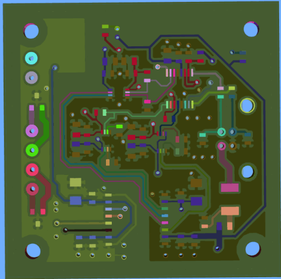

# ZofzPCB

Couple of days ago, I found a very good 3D viewer software for PCB’s called [ZofzPCB](https://www.zofzpcb.com/).

It creates very good looking 3D views of PCBs from GERBER files. It is also FREE. :)

You may manually or automatically (I haven’t tried it yet.) add stack-up of your PCB with copper, soldermask, silckscreen layers, drills, board outlines and prepregs. Then it will create 3D view your PCB. Of course model doesn’t have parts on it.

I tried it with 2 different boards. One is a 5×5 cm 2-layer board. I created a 3D view for this board on a i7 machine. It took few seconds to create a 3D view. The second one is 10 x 20 xm 10-layer board. This time, I used a i5 machine with only on-board, cheap graphics card, not a high-end machine, and it took 3-4 minutes to create 3D view. But once you create 3D view, you may save your model and reopen it in ZofZPCB without importing GERBERs anymore. Importing is needed for only once.

## Features That I Like

* Being able to move board to any direction and view it from any angle.
* Built-in color presets. Especially MULTIPCB shows very realistic model if your board soldermask is green. Of course, you can change any color and save new color set.
* Net Color Haven color preset shows you a net color heaven. Coppers connected to same net are shown in same color. It is good if you have fairly low number of nets:
    

    But after some point, it may be little confusing:

    

    Don’t worry, you don’t have to use that feature to distinguish nets. I will mention about a very impressive feature to find connections.

## Features That I Love

* When you point your mouse pointer to a copper trace or pin and hit N key, coppers, pads and vias connected to that net start to blink.
* Peel option is great with net blinking. It is possible to peel board layer by layer. When I showed ZofZPCB to few colleagues of mine, they were impressed at that stage.

## Features That I Will Like

* It will be nice if it is able to report total trace length from one pad to another pad. Further, reporting trace resistance from one pad to another (considering trace or fill area geometry and via resistances) could be great.

Thank you [Rafal Powierski](https://twitter.com/zofzpcb) for that great tool. Here is a video that shows all features of ZofzPCB:

<iframe width="560" height="315" src="https://www.youtube.com/embed/1dPTF0pxXdo" frameborder="0" allow="accelerometer; autoplay; encrypted-media; gyroscope; picture-in-picture" allowfullscreen></iframe>
