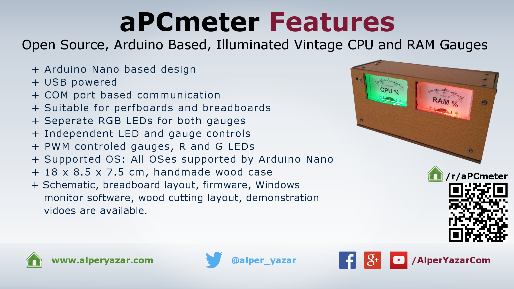

# aPCmeter

This project is just for fun. It is used to monitor CPU and RAM usage of a computer via vintage looking illuminated gauges. aPCmeter uses Arduino Nano v3 as controller. It is completely an open source project and you can build your aPCmeter easily. All building steps and internals of Arduino software are explained in detail.

Here is the aPCmeter in a nutshell:

*aPCmeter in a nutshell*

|               |               |
| ------------- |-------------|
| Files (GitHub) | [https://github.com/alperyazar/aPCmeter](https://github.com/alperyazar/aPCmeter) |
| Known Issues | [https://github.com/alperyazar/aPCmeter/issues](https://github.com/alperyazar/aPCmeter/issues)
| Photo Gallery | [https://www.flickr.com/photos/134583834@N07/albums/72157666249172802](https://www.flickr.com/photos/134583834@N07/albums/72157666249172802) |
| Hackaday.io | [https://hackaday.io/project/10554-apcmeter](https://hackaday.io/project/10554-apcmeter) |

*Links*

## Features

Here is the summary of features in "catalog" style:

*Summary of Features of aPCmeter.*

## What is aPCmeter?

Actually there is nothing more to say about the project. You saw the pictures and features. It is a project just for fun. **aPCmeter** can be considered as **a PCmeter** or **alper’s PCmeter** or **analog PCmeter**.

aPCmeter provides a COM port based communication interface to PC. It possible to adjust gauge positions and brightness of LEDs over this interface. aPCmeter can’t detect CPU and RAM usage of computer itself. A proper computer software should drive aPCmeter hardware (LEDs and gauges). aPCmeter works like a *slave* device.

Initially I saw Analog PC Stats Meter project on the web ([http://www.lungstruck.com/projects/pc-meter/](http://www.lungstruck.com/projects/pc-meter/)) then I decided to build my own based on this idea.

!!! note
    aPCmeter project consists of only hardware components + Arduino software. No computer software is given with this project (unlike Analog PC Stats Meter project). On the other hand, a computer software must run to get CPU and RAM utilization information from operating system and send it to the aPCmeter. I will publish that software under different project name. You can consider aPCmeter as missing. But you can write your simple PC software because communication protocol of aPCmeter is described in detail. I will update this section after publishing the computer software (I hope that I will remember to update).

## Do It Yourself (DIY)

!!! warning
    AS IS, ABSOLUTELY NO WARRANTY. TAKE YOUR OWN RISK

If you build your own aPCmeter just download files from Github (link is given at the top) and follow the steps given in `HowToBuild` folder. I prepared very detailed document. If you have any problem, you can contact me always.

## Similar Projects

I have found these projects on the web:

* [http://www.lungstruck.com/projects/pc-meter/](http://www.lungstruck.com/projects/pc-meter/)
* [https://hackaday.io/project/10629-usb-analog-panel-meters-w-arduino](https://hackaday.io/project/10629-usb-analog-panel-meters-w-arduino)
* [http://www.uchobby.com/index.php/2008/02/12/arduino-analog-gauge/](http://www.uchobby.com/index.php/2008/02/12/arduino-analog-gauge/)
* [https://www.youtube.com/watch?v=zbE6zpmrZYw](https://www.youtube.com/watch?v=zbE6zpmrZYw)

## Log Posts

Newest to Oldest

* [aPCmeter project is published](2016-10-08-apcmeter-project-is-published.md)
* [Let’s build a PC meter, in an analog way!](2016-02-02-lets-build-analog-pc-meter.md)
