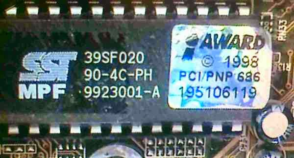

# İBTÇ: Anakartı Tanıyalım

Eveeeet, konu ile ilgili [bir önceki yazımda](2012-07-29-ibtc-sorunu-belirleme.md) belirttiğim üzere sorunun BIOS kaynaklı olduğundan şüphelendiğimi belirtmiş ve disket aracılığı ile kurtarma işlemine girişeceğimden bahsetmiştim. Bu aşamada BIOS EEPROM'undaki kodun bozulduğunu tahmin ediyordum. Bu sebepten dolayı da bilgisayar düzgün olarak açılmıyordu. BIOS EEPROM'unu düzgün bir kod ile düzeltebilmek için hangi kodu koyacağımı bulmam gerekiyor. Bunun içinde anakartın marka ve modelini tespit etmek gerekiyor. Bu açıdan anakarta biraz yakından bakmak istedim.

Genel bir fotoğraf koyarak işe başlayalım:

*Anakartın Genel Görünümü*

İlk bilgisayarımın anakartı gördüğünüz gibi. Bir de üzerindeki çıkışları bir listeleyelim:

* 1 x PS/2 Klavye Girişi
* 1 x PS/2 Fare Girişi
* 2 x Seri Port
* 1 x Paralel Port
* 3 x RAM Slotu
* 5 x PCI Slotu
* 2 x ISA Slotu
* 1 x AGP Slotu
* 2 x IDE Soketi
* 1 x Disket Sürücüsü Soketi
* 1 x PGA370 İşlemci Soketi

Evet, ilk bilgisayarımın ana kartı yukarıdaki gibi. İşlemcim ise [Intel Celeron 466 MHz](http://www.cpu-world.com/CPUs/Celeron/Intel-Celeron%20466%20-%20FV80524RX466128%20%28FV524RX466%20128%29.html). Hazır açmış iken, anakarttaki çiplere daha yakından bakmak istedim.

## Kuzey Köprüsü

*Anakartta, kuzey köprüsü olarak VIA firmasının VT82C693A entegresi kullanılmış.*

## Güney Köprüsü

*Anakartta, güney köprüsü olarak VIA firmasının VT82C596B entegresi kullanılmış.*

Hemen altta yazan 9941 sayısı da, entegrenin 1999 senesinin 41. haftasında üretildiğini söylüyor. Fotoğrafın sağ alt köşesinde BIOS CMOS pilinin bir kısmını ve bir üstte de muhtemelen saat için kullanılan ve yine frekansının 32.768 kHz olduğunu düşündüğüm kristali de görebiliyoruz.

## BIOS EEPROM

*Sistemde BIOS çipi olarak SST firmasının 39SF020 kodlu entegresi kullanılıyor.*

BIOS (Basic Input/Output System) kodları bu entegrede bulunuyor. Entegre 256 KByte'lık bir EEPROM'dan başka bir şey değil. Bilgisayar ilk açıldığı zaman bu entegre içerisindeki kodlar çalışmaya başlıyor. Eğer her şey yolunda gidiyorsa hard diskimizde kurulu olan işletim sistemi kodları çalışmaya devam ediyor. Bilgisayarın bu entegre içerisindeki koddaki bozukluktan dolayı açılmadığını düşünüyorum. Veya entegre bozulmuş olabilir. Bozuk entegreyi değiştirmek içerisindeki bozuk kodu düzeltmekten daha zor olacak. Çünkü 2000'lerde kullanılmış bu entegre halen üretilmiyor olabilir. Şansıma entegre DIP kılıfında ve soketle takılmış. Yani söküp takması ve dışarıda breadboard gibi yerlerde kullanması kolay. Bu da eski bir anakartla uğraşmamın avantajı olmalı. :) Yeni anakartlarda muhtemelen PLCC gibi kılıflarda EEPROM'lar kullanılıyordur. Bunları breadboard gibi yerlerde kullanmak daha zor.

Entegrenin üzerinde bir de AWARD etiketi bulunuyor. İlerleyen günlerde "AWARD BIOS" en çok kullandığım anahtar kelimelerden biri olacak muhtemelen. :)

## Diğer Entegreler

Yukarıdaki 3 entegreyi anakartı açar açmaz fark etmek ve görevlerini tahmin etmek zor değil. Bilgisayar anakartları ile haşır neşir olmadığım için aşağıdaki entegrelerin ne olduğunu araştırdıktan sonra öğrendim.

*ITE Chips*

Yukarıdaki ITE marka iki entegre paralel ve seri portun yakınlarında bulunuyor. Yukarıdaki IT8687R kodlu entegre "I/O Buffer Chip" olarak geçiyor. Datasheet'inde de seri port ile ilgili pinleri olduğunu görebilirsiniz. Seri portun yakınına boşuna konmamış demek ki.

IT8971F-A kodlu entegrenin datasheetini bulamadım. Çok da detaylı aramadım aslında, elbet vardır bir yerlerde. Onu ararken karşıma IT8973 kodlu entegrenin datasheeti çıktı. O da "Advanced I/O" olarak geçiyor. 8971 de muhtemelen 8687 türevi bir entegredir diye düşünüyorum. Belki bu da paralel port ile ilgilidir. Çok üzerine düşmedim açıkçası.

*w83194r*

W83194R-39A kodlu entegre RAM slotlarına, kuzey köprüsüne ve işlemciye yakın bir yerde karşıma çıkıyor. Datasheet'te ilk açıklama olarak "The W83194R-39/-39A is a Clock Synthesizer which provides all clocks required for high-speed RISC or CISC microprocessor such as Intel Pentium II. " şeklinde bir ifade çıkıyor. Buradan da entegrenin aslında osilatör olarak çalıştığını anlıyoruz. Yine datasheet'te entegrenin 14.318 MHz'lik kristale ihtiyaç duyduğunu görebiliyoruz. Fotoğrafta da kristali görebilmek mümkün.

Bunun dışında anakart üzerinde bazı 74 serisi "basit" entegreler ve güç MOSFETleri bulunuyor. Onların fotoğraflarını koymuyorum.

Tamam, iyi güzel anakartı bir inceledik. Ama marka ve model sorusuna hala cevap bulamadık. **Anakartı üreten firma nasıl bir firmaysa, anakart üzerine ne marka ne de model ismi yazmışlar.** Anakartı kasadan söküp altına da baktım ama orada da herhangi bir bilgi yok. Elimde olan tek şey, bu bilgisayarı aldığımız zaman bilgisayarcının verdiği bir kutuydu. Kutunun üzerinde "ASKA" ya benzer bir yazı vardı. Benzer diyorum çünkü yazı biçiminden dolayı harfler tam seçilmiyordu. İnternetten baktığımda gerçekten de ASKA diye bir anakart firması vardı. Tabi o zamanlarda verilen kutunun bizim bilgisayara ait olmama ihtimali de var. Bu bilgisayarı "toplattığımız" için, oradan herhangi bir kutu da verilmiş olabilir. Neyse ki sonradan bulduğum kadarı ile bu anakartın markası da **ASKA** ve modeli de **5892**. Detayları [burada](http://www.motherboard.cz/mb/aska/SST-5892.htm) bulunuyor. Yine de tam olarak model numarasından emin olamıyorum. Ama listelenen özellikler benim anakartımla örtüşüyor diye doğru modeli bulduğumu umuyorum. Bağlantısını verdiğim [http://www.motherboard.cz](http://www.motherboard.cz) adlı site anakartlarla ilgili büyük bir veritabanı sitesi. Belki sizin de işiniz düşebilir bir gün.

Son olarak da bu anakart için uygun BIOS programını bulmam gerekiyordu. Bunun için de yardımıma [upDrivers](http://www.updrivers.com/) adlı bir site yetişti. ASKA 5892 ile ilgili BIOS dosyasına [buradan](http://www.updrivers.com/getdriver/Motherboard/Aska/SST-5892_2MB_VIA-BIOS/6921.html) erişilebiliyor.

İşin güzel kısmı da dosyayı indirince içerisinde çıkan notta "Award BIOS (VT82C693+VT82C596B, VT82C693A+VT82C596B)" ve "For ITE Super IO chip" şeklinde ifadeler geçiyor olması. Dikkat ederseniz yukarıda kuzey köprüsü olarak VT82C693A ve güney köprüsü olarak da VT82C596B entegrelerinde bahsetmiştim. Yine aynı şekilde ITE marka I/O entegreleri bulunuyordu anakartın üzerinde. Doğru dosyayı bulduğuma biraz daha inandıran bir nokta da dosyanın içinden çıkan ve boyutu 256 KByte olan BIN uzantılı bir dosya oldu. Fotoğrafını gösterdiğim BIOS hafızası da 256 KByte kapasitesinde. Herhalde bu dosyayı direkt olarak BIOS EEPROM'una kaydetmek gerekiyor. Bir nevi ISO gibi imaj dosyası diye tahmin ediyorum.

Bakalım bu dosyayı EEPROM'a koyabilecek miyim…
