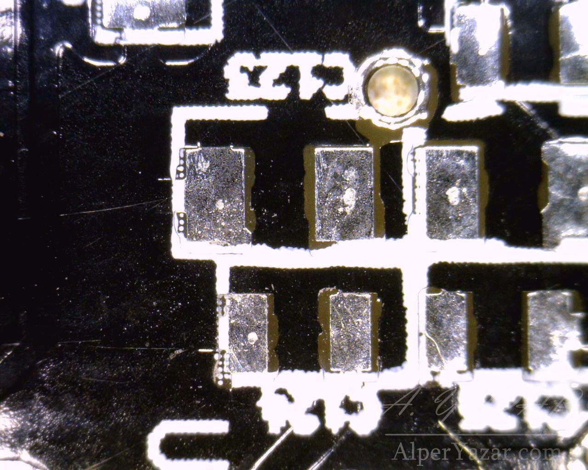
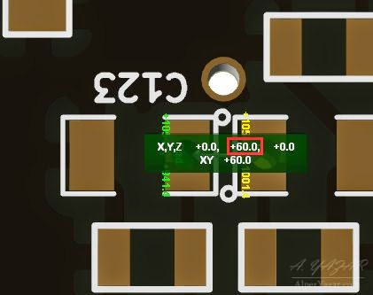
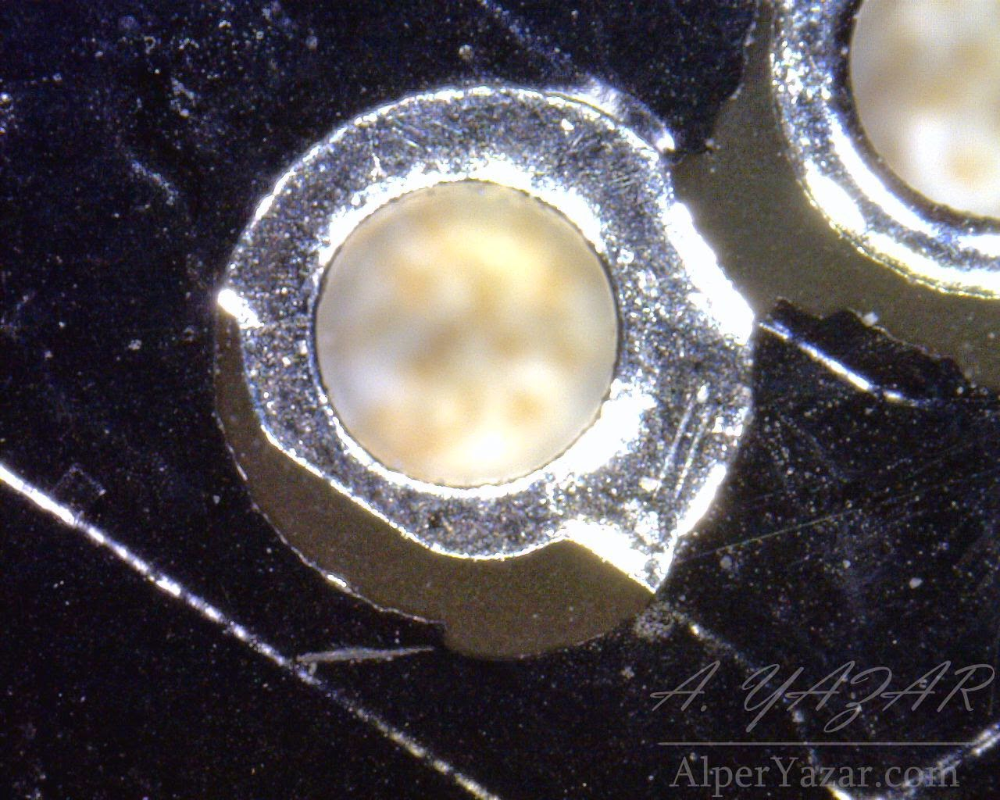
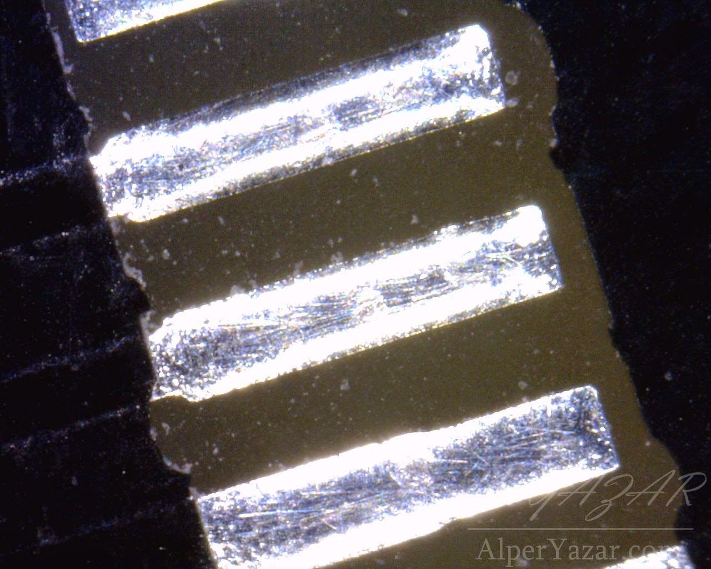
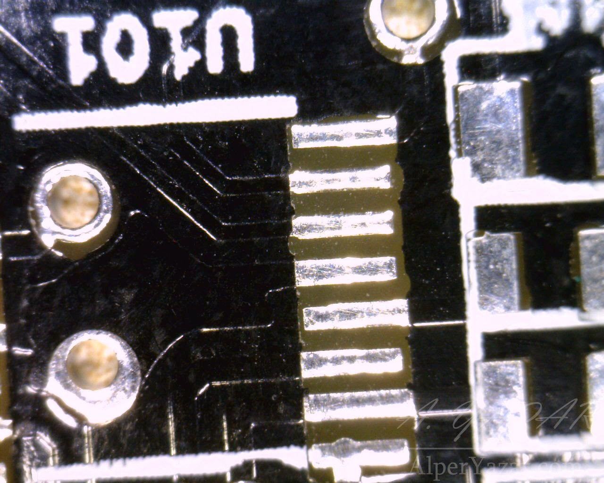
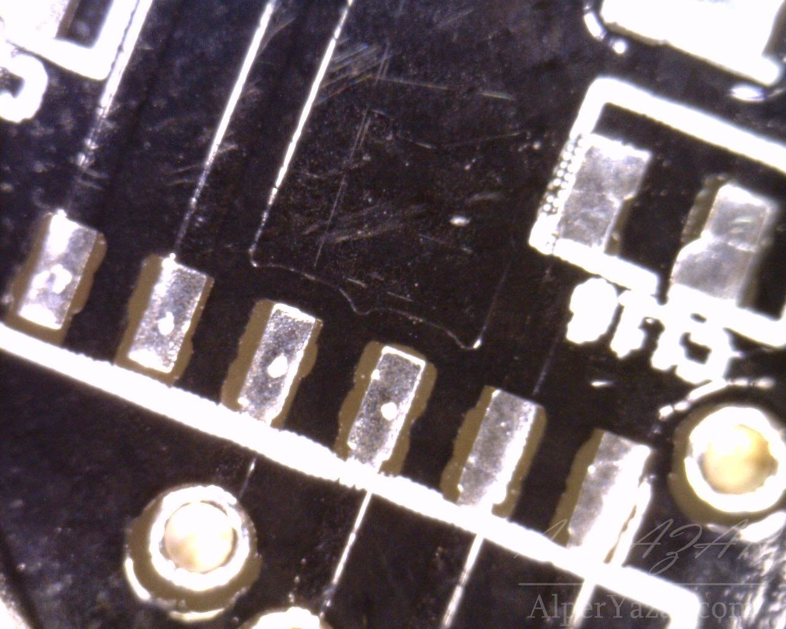
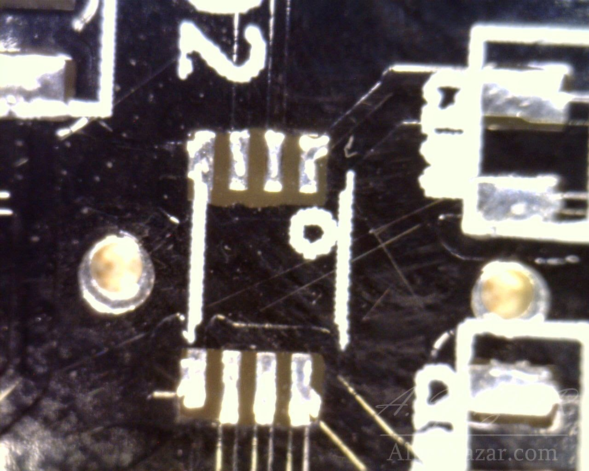
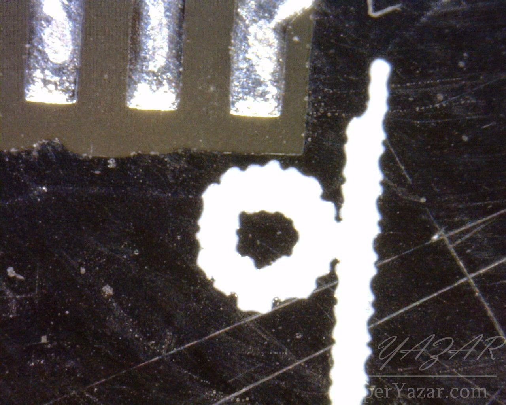
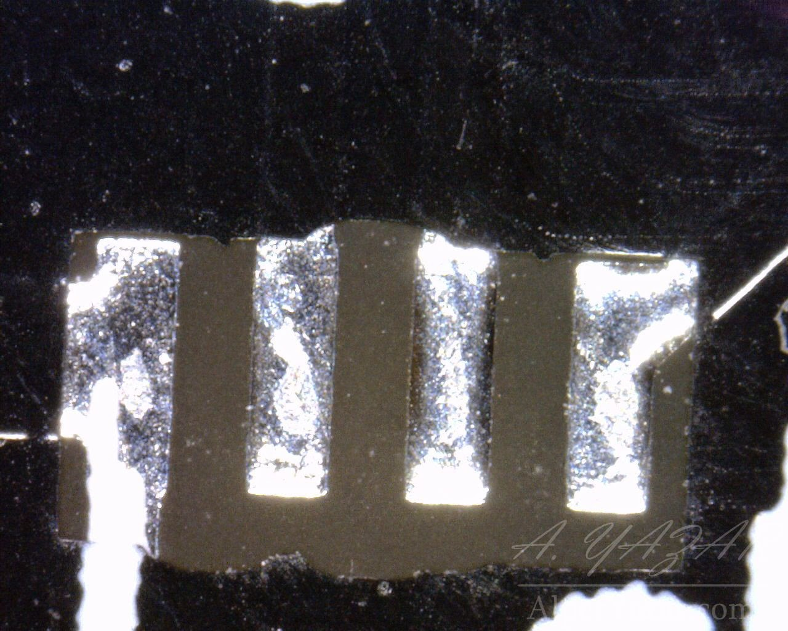
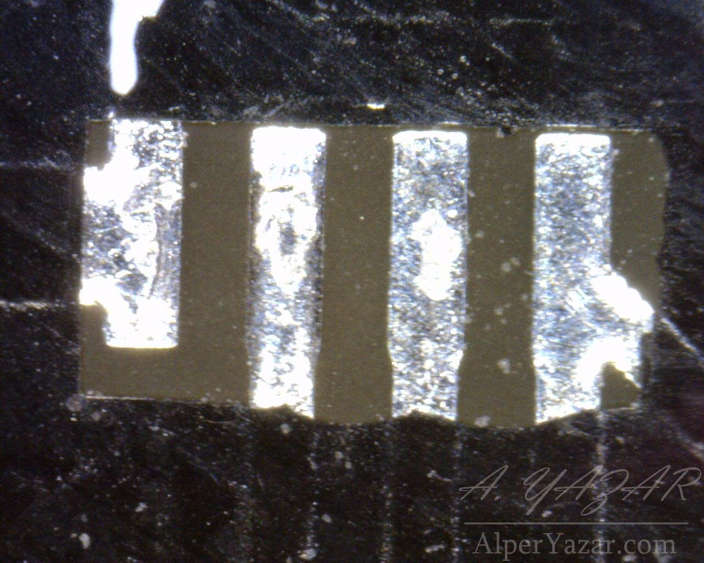

# Close Look At "Dirty Boards"

[As I mentioned earlier](2015-01-13-my-dirty-isousbrs422-boards-arrived.md) for my first open source project called [isoUSBRS422](index.md), I ordered PCBs from [dirtypcbs.com](https://dirtypcbs.com). They arrived in January. I took some photos using USB microscope.

Boards are dirty. Especially, soldermask layers aren't perfect. My first prototype is work as I expected. So they should be fine in terms of electrical connections. Also, you may see flying probe marks on pads for electrical test (I think) done by PCB fab house.

## Photos

Actual:

Gerber:

C123 and C124 are 0805 and 0603 capacitors respectively. Normally, silk screen lines should touch pad corners. As a reference, distance between center of rightmost pad of C123 and center of pad next to it is 60 mili inches.

Ring width isn’t uniform and soldermask isn’t perfect.

These are 1.4mm x 0.35mm pads with 0.65mm pitch. Ideally (according to gerber files), there should be soldermask between pads. Distance between edges of two consecutive pads is approximately 12 mili inches. Although minimum solder mask distance is given as 3.5mm for black soldermask (I think `Min solder dam` is that parameter. Please correct me if I am wrong.) on dirtypcbs spec page, PCB fab house didn’t put soldermaks between pads.

This is zoomed out version of previous photo.

Here is photo of another IC. For that one, edge distance between consecutive pads is 30 mili inches.

These photos are showing smallest component on my board. Distance between pads is approximately 8 mili inches. Pads are approximately 32 mili inches x 12 mili inches. Similarly, there are soldermask between edges in Gerber file.

## Comments

* First of all, dirtypcbs states their PCBs as "creppy" and "dirty". :) So, you should not expect perfect boards and they are obviously not. They are suited for prototyping not for production as you guess.
* Boards seem to be e-tested which is good.
* Silkscreen layer doesn’t fit perfectly to board. At some regions lines aren’t straight. Reference text of some components couldn’t be read easily.
* For relatively fine pitched components there is no soldermask between pads, although according to specs there should be (as far as I understand specs correctly.) I produced one prototype by hand soldering and this doesn’t cause a problem. But, if you are planning to apply solder paste and reflow the board (of course toaster oven if you are a hobbyist :)), these non solder masked areas may be a problem.
* Pads are not perfectly flat. Especially for small ICs, once you put component on PCB it doesn’t stand on pads nicely.

According to me, considering pricing, dirtypcbs boards are preferable for prototyping. Apart from technical details, [I was also happy about shipping time.](2015-01-13-my-dirty-isousbrs422-boards-arrived.md)
