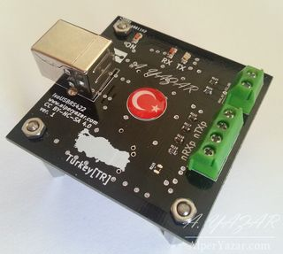

# First version (v1) of isoUSBRS422 Project is Completed

*Component side of isoUSBRS422 board*

[I had announced](2014-12-23-new-project-isousbrs422.md) my first open source hardware project on my blog in December 2014. This is an open source, isolated USB ↔ RS-422/RS-485 converter board.

Today, I finished all jobs related to this project and published all necessary files. I took approximately 1 year to finish it. It is very long time for such project but I worked for my MSc thesis work almost all my spare time. After finishing my thesis work, I was able to finish this project.

Finally, **I prepared 6 tutorial videos with total run time ~1.5 hours (!) for makers.** It took lots of time, really. All files are also published. My first hardware project is completed! Yay!

* Project files: [https://github.com/alperyazar/isoUSBRS422](https://github.com/alperyazar/isoUSBRS422)
* Tutorial videos: [https://www.youtube.com/watch?v=EZh2zi6m1yI&list=PLr5LL6z9GIeGnNSeiEEnGr73dqn5cAOdi](https://www.youtube.com/watch?v=EZh2zi6m1yI&list=PLr5LL6z9GIeGnNSeiEEnGr73dqn5cAOdi)

## The First Video

<iframe width="560" height="315" src="https://www.youtube.com/embed/EZh2zi6m1yI" frameborder="0" allow="accelerometer; autoplay; encrypted-media; gyroscope; picture-in-picture" allowfullscreen></iframe>
