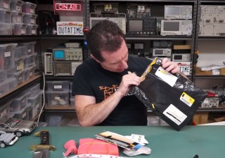

# isoUSBRS422 is on EEVblog "Mailbag" (+my comments)

*Dave Jones is opening my parcel.*

Vow, that’s great! My parcel which includes an isoUSBRS422 board sent from Turkey is opened in **EEVblog #833 - Mailbag** by **Dave Jones**. I am very happy because first it is arrived after a relatively long and untraceable delivery process and second I got comments from Dave and perhaps from other viewers in the following days.

[Here](https://www.youtube.com/watch?v=dXbbJOH59oo) is the video. **My section is in between 13:42 - 18:26.**

<iframe width="560" height="315" src="https://www.youtube.com/embed/dXbbJOH59oo?start=822" frameborder="0" allow="accelerometer; autoplay; encrypted-media; gyroscope; picture-in-picture" allowfullscreen></iframe>

The shipment was bit stressful. I sent on 23.11.2015 using PTT which is national post service of Turkey. Their claim was export from Turkey within 3 working days and then arrival in Australia within 16 working days. So, item was exported from Istanbul on 26.11.2015 and arrived in Australia on 10.12.2015 according to Auspost. PTT provided what they promised. **Big thumbs up for PTT.** Unfortunately, I realized that Auspost didn’t provide a public track service for this kind of shipments. I was disappointed. Couple of days ago, I contacted to Auspost support and they were very responsive. I learned that it was arrived in Australia on 10.12.2015 and it was still in transit. Guess what happened. I saw my package on Mailbag video in the morning and got very surprised. Anyway, that’s little story of my package. But, hey this is a 400% cheaper option than UPS.

## My comments to the video

Dave is kind enough to allocate time for my package in this video, thank you Dave. He did also show all pictures from Turkey in addition to the board. I am really happy. I hope he didn’t miss small Turkish tea and coffee packages in the parcel.

I would like to also say something about his comments. Here they are:

**Dave @ 13:52 About my gender**

Yes, I am a male.

**Dave @ 14:00 About top 10 country**

I wish, Turkey would be in top 10 list.

**Dave @ 15:51 About photos**

Nope, sorry, they are from the Internet.

**Dave @ 16:00 About the Trojan Horse**

AFAIK, this horse from the movie. Also, ancient Troy is in borders of Çanakkale today. Check: [https://en.wikipedia.org/wiki/Troy](https://en.wikipedia.org/wiki/Troy)

**Dave @ 16:00 About capital of Turkey**

Sorry, Ankara is the capital city of Turkey.

**Dave @ 16:50 About the bloody tripod**

Damn damn!

**Dave @ 17:15 - 18:26 About the isoUSBRS422 board**

Here is the story: This is also my first "cheap PCB production in China" experience. I decided to use [DirtyPCBs](https://dirtypcbs.com). The cheapest option is 5x5 cm protopack by 14$ and the next option is 25$ with the maximum limit 10x10 cm. If you design a 2x6 cm board for example, it costs 25$. So, I had to stay within 5x5 cm limit. This would be my first PCB from there and I didn’t know quality of PCB, practical clearance limits etc ([Previous post about PCB](2015-05-09-close-look-at-dirty-boards.md)). I decided not to spend too much money for the first trial. I use RS-422 converters much more than RS-232 converters in my daily jobs so my primary goal was to fit an RS-422 converter. Yes, I agree that it would be nicer if it also had an RS-232 interface but I didn’t want to squeeze components too much for the first trial.

I wanted to hide mess of all "fixed" components from user and put all of them at the bottom. "No user-serviceable part at the bottom!". Resistors at the top are for termination and user may want to change them. So they are at the top. However, components at the bottom may stay untouched. This is the reason why I went to effort for double-sided board. Also, it costs same as single-sided board. Actually, it is designed to stay on spacers. 4 spacers are inside the small pink one shown at 14:50. I think Dave would open it after shooting video, who knows, no problem at all.

I misremembered that Dave likes black PCBs. But he hates them especially the glossy ones. Also, I did promote color of the board in my letter. This is big fail for me, palm face. I wanted to try black colored solder mask option, no mat option at all.

**Here are my additional notes:**

One of my goals was to see the limits of DirtyPCBs. This is why I also included a tiny IC, SN74LVC2T45. The same circuit can be built using less number and easy to solder components. Similarly Turkey figure at the top is primarily here to see the resolution of silk screen layer. Turkey has wavy borders and it is suitable to test the fab house limits too.

Why is there a Turkish flag sticker at the top? Well, to see how it looks like. Some years ago I saw an Arduino board with Italian flag sticker on it and I wanted to see the case for Turkish flag. I also wanted to say that there are many makers in Turkey too.

Why did I send to EEVblog? Well, just for fun. I have been watching EEVblog for a long time and I always appreciated makers who sent their open source designs to Mailbag videos. I wanted to send one too. isoUSBRS422 isn't a commercial product then I don’t need any commercial. As I said, just for fun. It is a good memory for me, thanks EEVblog.
